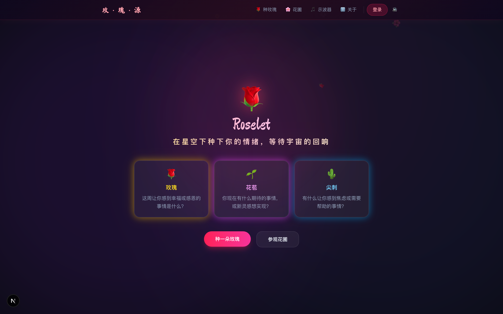
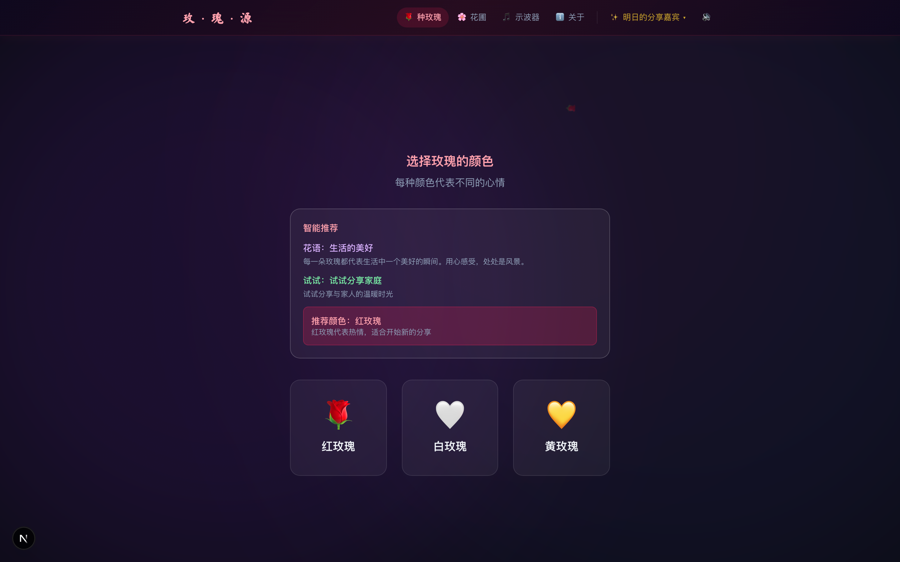
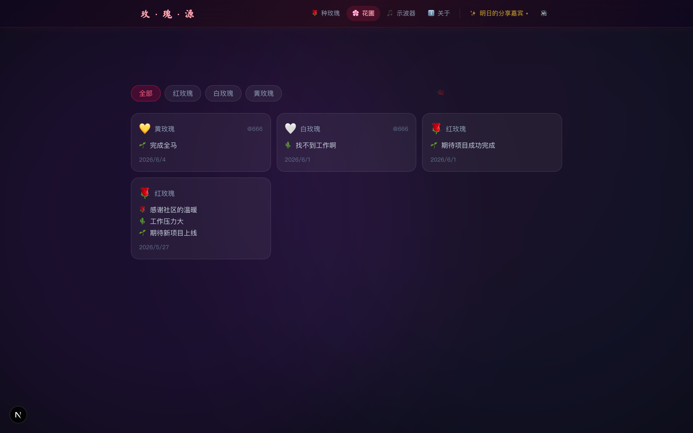

# Roselet 项目分享

> 为社区种一朵玫瑰吧 —— 情绪仪式的数字花圃

---

## 分享材料清单

| 材料 | 文件 |
|------|------|
| 🎙️ 讲稿（本文档） | `docs/PRESENTATION.md` |
| 📸 界面截图 (6张) | `docs/screenshots/` |
| 🌐 可视化概览 | `docs/screenshots/index.html` (浏览器打开) |
| 🎨 设计系统文档 | `DESIGN.md` |
| 📋 产品愿景文档 | `PRODUCT.md` |
| 📖 README | `README_zh.md` |
| 🔗 GitHub | [github.com/qiaopengjun5162/roselet](https://github.com/qiaopengjun5162/roselet) |

---

## 30秒版（电梯演讲）

Roselet 是一个社区破冰互动应用，灵感来自经典的 Rose-Bud-Thorn 破冰游戏。你种下「玫瑰」表达感恩、「花苞」寄托期待、「尖刺」释放焦虑，所有人的情绪汇成一片在月光下发光的数字花圃——AI 会异步给你一句个性化的回响。

技术上最独特的地方：一套 **90/10 Rust-TypeScript 架构**。情绪分析、推荐引擎、表单校验、状态机等全部业务逻辑用 Rust 编译成 WASM，Web 端和微信小程序共用同一份代码，一共 461 个测试、90%+ 覆盖率。

---

## 一句话介绍

Roselet 是一个社区破冰互动应用：你种下「玫瑰」表达感恩、「花苞」寄托期待、「尖刺」释放焦虑，所有人的情绪汇成一片在月光下发光的数字花圃——AI 会异步给你一句个性化的回响。

---

## 灵感来源：Rose, Bud, Thorn 破冰游戏

这是一个经典的团队破冰方法，通常在会议或工作坊开始时使用：

| 符号 | 名称 | 对应问题 |
|------|------|---------|
| 🌹 | **玫瑰 (Rose)** | 这周让你感到幸福或感恩的一件事是什么？ |
| 🌵 | **尖刺 (Thorn)** | 现在有什么让你感到焦虑或需要帮助的事情？ |
| 🌱 | **花苞 (Bud)** | 你有什么期待？这周有什么新灵感想实现？ |

**核心洞察**：这个游戏之所以有效，是因为它给了每个人一个安全的结构来表达情绪。把它数字化，就可以让社区在异步时空中持续进行这种「情绪破冰」。

---

## 产品：三个界面的仪式

### 第一屏：规则介绍

用户扫码/点链接进来，看到规则说明——三种花的含义。点击「种一朵玫瑰」进入下一步。



### 第二屏：种花交互

一朵 2D/3D 的玫瑰呈现在深色背景中。用户选择颜色（红/白/黄），花瓣、花苞、尖刺上各有一个发光点。点击发光点弹出对话框，依次填写三种情绪。填写完毕后，右下角亮起「种下玫瑰吧」。



### 第三屏：种入花圃

一段动画——玫瑰被种入社区花圃，各色玫瑰共同生长。文字浮现：「谢谢你在社区种下的玫瑰」。AI 后台异步生成个性化回复。



---

## 技术：90/10 Rust-TypeScript 架构

**这是 Roselet 最独特的技术决策。**

```
┌─────────────────────────────────────────┐
│           TypeScript (10%)              │
│  React 组件 · fetch() · Tone.js · Taro │
│         纯平台调用层 + UI 渲染          │
├─────────────────────────────────────────┤
│           Rust → WASM (90%)             │
│  情绪分析 · 推荐引擎 · 表单校验        │
│  颜色元数据 · 音频参数 · 花瓣轨迹      │
│  天空时段 · 烟花粒子 · 花圃布局 · 状态机 │
│         全部业务逻辑                    │
└─────────────────────────────────────────┘
```

**核心理念**：凡是能写 Rust 单元测试的逻辑，一律不留在 TypeScript 里。

**为什么这样做？**

- **跨端复用**：同一份 Rust 代码编译成 WASM，Web 端和小程序端共用。未来如果做 App（Tauri 或 React Native），逻辑层零改动。
- **可测试性**：业务逻辑全部在 Rust 里，可以写纯函数单元测试。目前 461 个测试，90%+ 代码覆盖率。
- **类型安全**：Rust 的类型系统在编译期消除了一整类运行时错误。

### WASM 模块清单（共 11 个模块，~112KB）

| 模块 | 功能 |
|------|------|
| `emotion.rs` | 文本 → 情绪分析 → 音频参数映射 |
| `audio.rs` | 玫瑰属性 → Tone.js 示波器参数 |
| `color.rs` | 颜色元数据（emoji/label/色板） |
| `petal.rs` | 确定性花瓣飘落轨迹生成 |
| `garden.rs` | 花圃布局 + 颜色过滤 |
| `plant.rs` | 种花表单校验 |
| `datefmt.rs` | 中文日期格式化 |
| `store.rs` | 全局状态机（Redux 风格） |
| `api_client.rs` | URL/请求体构造 |
| `fireworks.rs` | 烟花粒子系统（seed RNG） |
| `offline.rs` | 乐观更新 + 离线缓存合并 |

### 技术栈

| 层级 | 技术 |
|------|------|
| 后端 | Rust / Axum / SQLx / PostgreSQL |
| 前端 | Next.js 16 / Tailwind CSS / shadcn UI |
| 小程序 | Taro 4 / React 18 / WXWebAssembly |
| 实时通信 | WebSocket (tokio broadcast) |
| 认证 | 双令牌 JWT (Access 15min + Refresh 30d, SHA-256) |
| AI | OpenAI 兼容 API (异步非阻塞生成) |
| 音频 | Tone.js 合成器 |
| 部署 | Docker Compose 一键启动 |

### 质量数据

```
Rust backend:   110 passed
Rust WASM:      139 passed
Web frontend:   146 passed
Miniprogram:     66 passed
Total:          461 passed

llvm-cov (workspace): 90.37% 行覆盖 / 88.41% region
  100%: flowers, petal, sky, keywords, pagination, user, docs, state
  99%+: garden (99.61%)
  97%+: audio (97.87%), api_client (98.15%)
  96%+: color (96.39%), fireworks (96.30%)
  90%+: plant (93.06%), emotion (91.43%), store (90.21%)
```

---

## 设计：「月下花圃」设计系统

**Creative North Star: 月下花圃**

Roselet 是一座深夜里的花圃，只有月光照亮它的轮廓。界面不是工具，是场所：用户走进来，在黑暗中找到自己的那朵花，轻轻种下，然后离开。

### 核心设计原则

1. **仪式性先于效率**：种花不是填表，是一次轻微的仪式。每个交互都应该感觉到一定分量。
2. **情绪不喧哗**：彻底剥离数量对比信号。不显示点赞数排行、热度计数、连续打卡。花圃里的花平等存在。
3. **边界消融**：背景是宇宙级别的深黑（lightness < 8%），元素从虚空中浮现，不被卡片框住。
4. **辉光代替阴影**：三种情绪色（琥珀/天蓝/品红）是唯一的饱和色。辉光是情绪的信号，不是装饰。
5. **毛笔字 + 系统字体**：Ma Shan Zheng 承载仪式性文字，PingFang SC 负责可读性。

### 绝对不做的事

- 不显示任何计数排名（点赞数、热度、排行榜）
- 不做游戏化（勋章、连续打卡、积分）
- 不用 Linear/Jira 式的规整卡片网格
- 不用 Headspace 式的粉紫马卡龙色调
- 玫瑰红不超过屏幕 10% 的面积

---

## 项目结构

```
roselet/
├── apps/web/              # Next.js 前端
├── apps/miniprogram/      # Taro 微信小程序
├── packages/core/         # 共享 TypeScript 类型
├── crates/backend/        # Rust Axum 后端
├── crates/recommend/      # Rust WASM 业务逻辑
├── docker-compose.yml     # 一键部署
└── justfile               # 任务自动化
```

---

## 为什么要做这个项目？

1. **验证一个假设**：情绪表达不需要社交量化来驱动。人们会因为在安静的夜晚有一个安全的去处而回来，不是因为看到了点赞数。
2. **验证一个架构**：90% 业务逻辑在 Rust WASM，Web 和微信小程序共用同一份代码。这是对「跨端复用」的一次实践。
3. **做一个有温度的作品**：它不是 SaaS，不是工具，是一个数字花圃。产品价值在于仪式感本身，不在于效率提升。

---

## 当前状态 & 下一步

- ✅ Web 端完整可用（注册/种花/花圃/AI 回复/音效/烟花/日夜背景）
- ✅ 微信小程序可运行（共用同一套 Rust WASM 逻辑）
- ✅ 461 个测试通过，90%+ 覆盖率
- ⏳ 找 5 个真实用户试用，收集反馈
- ⏳ 小程序上架审核
- 🔮 长期：Tauri 桌面端（复用同一套 Rust 逻辑）

---

## 链接

- GitHub: [github.com/qiaopengjun5162/roselet](https://github.com/qiaopengjun5162/roselet)
- 设计系统: [DESIGN.md](../DESIGN.md)
- 产品愿景: [PRODUCT.md](../PRODUCT.md)
